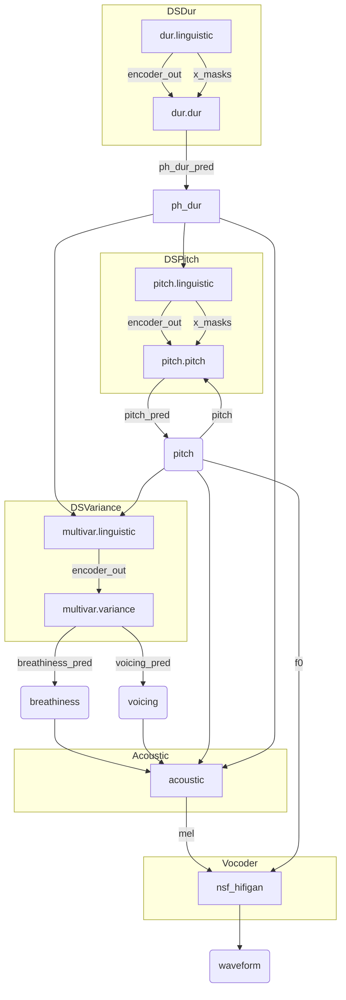

## 梳理 DiffSinger 模型的推理流程

主要指的是 OpenVPI 维护的版本。

大致分成方差模型（Variance Model）、声学模型（Acoustic Model）以及声码器（Vocoder）三个部分。

以 Qixuan 为例，其目录为下：

```tree
~\CODE\QYEDITOR\PRIV\QIXUAN_V2.5.0_DIFFSINGER_OPENUTAU
├─dsdur
├─dspitch
├─dsvariance
└─dsvocoder
```

在项目的根目录也存在着一系列的模型，其主要是 acoustic model。

### `dsdur/0817_qixuan_multilingual_dur.qixuan.linguistic.onnx`

| 名字 | 输入/输出 | 维度 | 描述 |
|:----:|:---------:|:----:|:-----|
| tokens | input | `int64[1,n_tokens]` |
| languages | input | `int64[1,n_tokens]` |
| word_div | input | `int64[1,n_tokens]` |
| word_dur | input | `int64[1,n_tokens]` |
| encoder_out | output | `float32[1,n_tokens,256]` |
| x_masks | output | `boolean[1,n_tokens]` |

### `dsdur/0817_qixuan_multilingual_dur.qixuan.dur.onnx`

| 名字 | 输入/输出 | 维度 | 描述 |
|:----:|:---------:|:----:|:-----|
| encoder_out | input | `float32[1,n_tokens,256]` |
| x_masks | input | `boolean[1,n_tokens]` |
| ph_midi | input | `int64[1,n_tokens]` |
| ph_dur_pred | output | `float32[1,n_tokens]` |

### `dspitch/0817_qixuan_multilingual_pitch.qixuan.linguistic.onnx`

| 名字 | 输入/输出 | 维度 | 描述 |
|:----:|:---------:|:----:|:-----|
| tokens | input | `int64[1,n_tokens]` |
| languages | input | `int64[1,n_tokens]` |
| ph_dur | input | `int64[1,n_tokens]` |
| encoder_out | output | `float32[1,n_tokens,256]` |
| x_masks | output | `boolean[1,n_tokens]` |

### `dspitch/0817_qixuan_multilingual_pitch.qixuan.pitch.onnx`

| 名字 | 输入/输出 | 维度 | 描述 |
|:----:|:---------:|:----:|:-----|
| encoder_out | input | `float32[1,n_tokens,256]` |
| ph_dur | input | `int64[1,n_tokens]` |
| note_midi | input | `float32[1,n_notes]` |
| note_rest | input | `boolean[1,n_notes]` |
| note_dur | input | `int64[1,n_notes]` |
| pitch | input | `float32[1,n_frames]` |
| expr | input | `float32[1,n_frames]` |
| retake | input | `float32[1,n_frames]` |
| steps | input | `int64` |
| pitch_pred | output | `float32[1,n_frames]` |

### `dsvariance/0816_qixuan_multilingual_multivar.qixuan.variance.onnx`

| 名字 | 输入/输出 | 维度 | 描述 |
|:----:|:---------:|:----:|:-----|
| encoder_out | input | `float32[1,n_tokens,256]` |
| ph_dur | input | `int64[1,n_tokens]` |
| pitch | input | `float32[1,n_frames]` |
| breathiness | input | `float32[1,n_frames]` |
| voicing | input | `float32[1,n_frames]` |
| retake | input | `boolean[1,n_frames,2]` |
| steps | input | `int64` |
| breathiness_pred | output | `float32[1,n_frames]` |
| voicing_pred | output | `float32[1,n_frames]` |

### `dsvariance/0816_qixuan_multilingual_multivar.qixuan.linguistic.onnx`

| 名字 | 输入/输出 | 维度 | 描述 |
|:----:|:---------:|:----:|:-----|
| tokens | input | `int64[1,n_tokens]` |
| languages | input | `int64[1,n_tokens]` |
| ph_dur | input | `int64[1,n_tokens]` |
| encoder_out | output | `float32[1,n_tokens,256]` |
| x_masks | output | `boolean[1,n_tokens]` |

### `0816_qixuan_multilingual_acoustic.qixuan.onnx`

| 名字 | 输入/输出 | 维度 | 描述 |
|:----:|:---------:|:----:|:-----|
| tokens | input | `int64[1,n_tokens]` |
| languages | input | `int64[1,n_tokens]` |
| durations | input | `int64[1,n_tokens]` |
| f0 | input | `float32[1,n_frames]` |
| breathiness | input | `float32[1,n_frames]` |
| voicing | input | `float32[1,n_frames]` |
| gender | input | `float32[1,n_frames]` |
| velocity | input | `float32[1,n_frames]` |
| depth | input | `float32` |
| step | input | `int64` |
| mel | output | `float32[1,n_frames,128]` |

### `dsvocoder/nsf_hifigan_qixuan_004.onnx`

| 名字 | 输入/输出 | 维度 | 描述 |
|:----:|:---------:|:----:|:-----|
| mel | input | `float32[1,n_frames,128]` |
| f0 | input | `float32[1,n_frames]` |
| waveform | output | `float32[1,n_samples]` |

### 流程



## Ort 使用 DiffSinger 的可行性

*如果这个也不行的话，那就放弃吧。*

# 声库模型的自动查找与尝试组织

主要有三种使用场景：

1. 解压了的 OpenUTAU 声库
2. 单纯的一堆 onnx 文件
3. onnx 文件以及确定了的配置

后者只需设计好相对应的规范，按照设置来确定模型的步骤即可。
